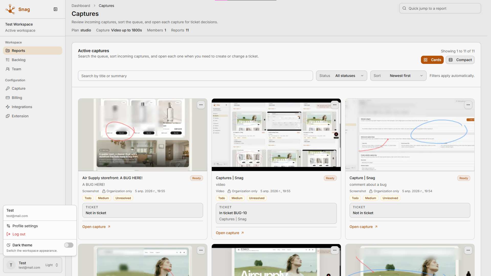
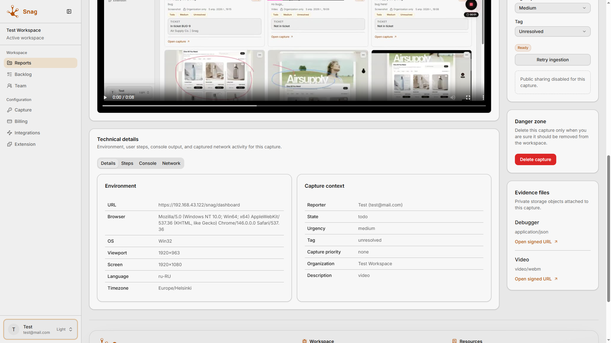
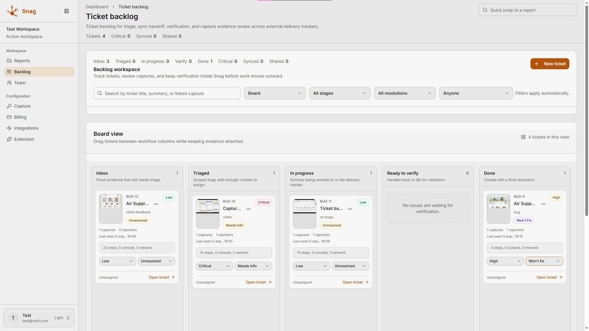
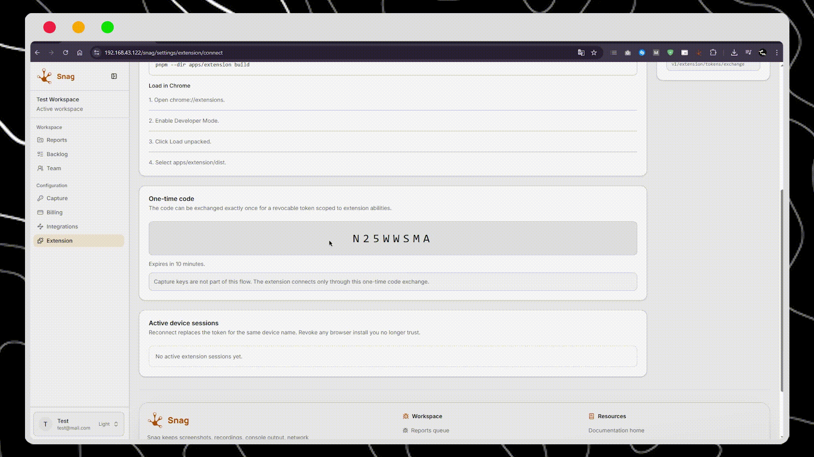
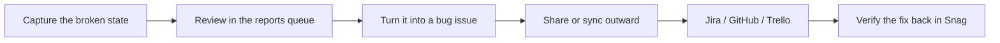
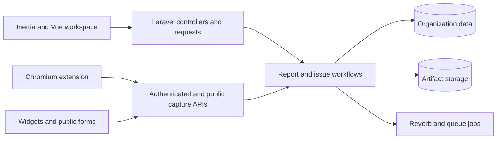

<p align="center">
  
</p>

<h1 align="center">Snag</h1>

<p align="center">
  Capture browser bugs with evidence, review them in one workspace, and hand them off cleanly without losing screenshots, recordings, steps, console logs, or debugger payloads.
</p>

<p align="center">
  <a href="#why-snag">Why Snag</a>
  &middot;
  <a href="#product-flow">Product Flow</a>
  &middot;
  <a href="#what-ships-in-this-repo">What Ships</a>
  &middot;
  <a href="#quick-start">Quick Start</a>
  &middot;
  <a href="#monorepo-map">Monorepo Map</a>
  &middot;
  <a href="#development-commands">Commands</a>
</p>

<p align="center">
  
  
  
  
</p>

<p align="center">
  
</p>

<p align="center">
  
</p>

<p align="center">
  
</p>

<details>
  <summary><strong>See Snag in action</strong></summary>
  <br />

  <p><strong>Connect extension</strong></p>
  <p>Connect the browser extension with a one-time code from the workspace so the device can start sending captures.</p>
  

  <p><strong>Image report</strong></p>
  <p>Take a screenshot, circle the problem, blur sensitive parts, add a note, and submit it as a report.</p>
  

  <p><strong>Video report</strong></p>
  <p>Record a short video through the extension and send it as a report with the same workspace flow.</p>
  

  <p><strong>See details</strong></p>
  <p>Open the full report details to review the captured steps, network activity, and supporting debugger context before triage.</p>
  

  <p><strong>Create ticket</strong></p>
  <p>Turn a report into a ticket, keep the evidence attached, and move the issue through to a done state.</p>
  

  <p><strong>Bug report widget</strong></p>
  <p>Show the website widget that customers can open on a live site to capture a bug and send a report without joining the workspace.</p>
  
</details>


## Why Snag

Snag is the evidence layer around delivery tools.

It does not try to replace Jira, GitHub, or Trello. It complements them.

Snag owns:

- capture
- screenshots and recordings
- reproduction context
- share links and handoff packages
- verification-friendly issue review

Your external tracker still owns delivery execution. Snag makes sure the bug arrives there with the context intact.

## Product Flow



The core product shape is simple:

- capture the bug
- keep the evidence attached
- triage it in one queue
- hand it off without rewriting context
- verify the fix with the same evidence trail

## What Ships in This Repo

| Surface | What it does |
| --- | --- |
| Reports queue | Incoming bug reports with screenshots, recordings, steps, console output, and network traces |
| Bug backlog | Issue-centric triage and verification workspace with external sync awareness |
| Public sharing | Share bug records safely without exposing private debugger payloads by default |
| Capture keys | Public intake for widgets, forms, and server-side relay flows outside signed-in workspace sessions |
| Website widget | Self-service bottom-right `Report a bug` launcher with screenshot capture, annotation, and public intake |
| Browser extension | One-time code connect flow for fast in-browser capture and submission |
| Capture SDK | Workspace package for embedding capture flows and widget surfaces from repo-native code |
| Integrations | Sync-oriented handoff model for external delivery systems while Snag remains the evidence layer |
| Billing and org controls | Plans, members, invitations, and workspace-level settings |

## Real Usage Scenarios

### 1. Internal QA triage

A QA lead records a broken checkout flow, sends the report into Snag, reviews the attached evidence in the queue, and turns it into a tracked bug issue.

### 2. Public website feedback widget

A customer-facing site uses a capture key to open a public upload session and create a report without requiring a signed-in Snag session.

### 3. Handoff to delivery tools

The team keeps evidence and verification in Snag, but pushes delivery work into Jira or GitHub when the bug is ready for execution.

## Where Snag Fits

| Snag owns | Your delivery tracker owns |
| --- | --- |
| bug capture | sprint planning |
| screenshots and recordings | backlog execution |
| console and network evidence | engineering workflow management |
| reproduction context | delivery status conventions |
| share links and handoff packages | release process |
| verification context | ticket lifecycle inside the tracker |

That split is intentional. Snag is strongest when it stays focused on evidence, review, and handoff quality.

## Quick Start

### 1. Install workspace dependencies

```bash
pnpm bootstrap
```

This installs root workspace packages and Composer dependencies for `apps/server`.

### 2. Choose a local runtime

#### Option A: XAMPP mode

This repo includes a Windows-friendly XAMPP command that assumes Apache and MySQL already exist outside the app runtime.

```bash
cd apps/server
php artisan snag:xampp
```

What it does:

- derives a local `/snag` app URL
- ensures the database exists
- applies migrations
- starts Vite, queue worker, scheduler, and Reverb
- keeps Apache and MySQL external under XAMPP

#### Option B: Docker dev stack

Use this if you want a local Docker runtime without XAMPP.

```bash
cp apps/server/.env.example apps/server/.env
pwsh ./scripts/docker/dev-up.ps1
docker compose -f docker-compose.yml -f docker-compose.dev.yml exec app php artisan key:generate
```

Raw compose equivalent:

```bash
docker compose -f docker-compose.yml -f docker-compose.dev.yml up --build
```

Docker dev services include:

- `nginx`
- `app`
- `worker`
- `scheduler`
- `reverb`
- `postgres`
- `redis`
- `minio`
- `mailpit`

Notes:

- if `APP_KEY` was empty, generate it once and rerun `pwsh ./scripts/docker/dev-up.ps1`
- the dev overlay runs migrations automatically on `app` startup
- frontend assets come from the built image and are synced into a shared volume
- this is a stable no-HMR Docker flow; after frontend changes, rebuild the stack or run `pnpm --dir apps/server build` before restarting it

#### Option C: Prod-like Docker smoke

Use this when you want an immutable-image style stack with separate `nginx` and `php-fpm`, but still on one local machine.

```bash
cp apps/server/.env.example apps/server/.env
pwsh ./scripts/docker/prod-build.ps1
docker compose -f docker-compose.yml -f docker-compose.prod.yml run --rm app php artisan key:generate
docker compose -f docker-compose.yml -f docker-compose.prod.yml up -d
docker compose -f docker-compose.yml -f docker-compose.prod.yml run --rm app php artisan migrate --force
```

Notes:

- if `APP_KEY` was empty, generate it once before the long-running `up -d` cycle
- the prod overlay keeps `nginx`, `app`, `worker`, `scheduler`, and `reverb` separate
- production services run as non-root where possible and use read-only filesystems with writable volumes only for required paths
- for real production, point `.env` at managed Postgres/Redis/object storage instead of the bundled local containers

### 3. Grant yourself a plan

For local development, you can create or upgrade a workspace user directly:

```bash
cd apps/server
php artisan snag:grant-plan you@example.com studio --create-missing
```

## Browser Extension

The Chromium extension uses an explicit one-time code exchange instead of relying on ambient first-party cookies.

Build it with:

```bash
pnpm --dir apps/extension build
```

Then load:

1. `chrome://extensions`
2. enable `Developer mode`
3. choose `Load unpacked`
4. select `apps/extension/dist`

Connect flow:

1. open `Settings -> Extension Connect` in Snag
2. copy the one-time code
3. paste the code into the extension popup with the HTTPS API base URL (or `localhost` during local development) and device name
4. exchange it for a revocable token
5. turn on `Start reporting` to enable the floating recorder on allowed pages
6. capture the active tab and submit the report

Full reference: [Browser Extension](./apps/docs/docs/extension.md)

## Public Capture Keys

Capture keys let external surfaces create Snag reports without a signed-in workspace session.

Use them for:

- website feedback widgets
- public bug forms
- embedded "Report a problem" buttons
- server-side relays

The public flow lives under:

- `POST /api/v1/public/capture/tokens`
- `POST /api/v1/public/capture/upload-sessions`
- `POST /api/v1/public/capture/finalize`

Full reference: [Capture Keys](./apps/docs/docs/capture.md)

## Website Widget

Snag includes a self-service website widget builder for non-technical installs.

Workspace owners and admins can open `Settings -> Capture -> Website widgets`, create one widget per site, limit allowed domains, customize the visitor-facing copy, and copy a ready-to-paste snippet.

Install snippet:

```html
<script async src="https://snag.example.com/embed/widget.js" data-snag-widget="ww_..." data-snag-base-url="https://snag.example.com"></script>
```

Visitor flow:

1. a fixed `Report a bug` launcher appears in the bottom-right corner
2. clicking it captures the current page immediately
3. the visitor can annotate the screenshot, add a short note, and continue
4. the widget asks for a final send confirmation
5. the widget shows a short success state without exposing a public share link

What the website widget sends:

- a screenshot of the visible page
- page URL and page title
- recent user actions leading up to the report
- console entries
- network request metadata without request or response bodies
- viewport size
- browser locale, user agent, platform, timezone, and referrer
- widget id and site label
- the visitor's short note
- optional explicit user context that the host site passes in

What it does not send:

- cookies
- localStorage or sessionStorage
- form field values
- request or response bodies
- arbitrary page data dumps

Optional host-side user context:

```html
<script async src="https://snag.example.com/embed/widget.js" data-snag-widget="ww_..." data-snag-base-url="https://snag.example.com"></script>
<script>
  window.SnagWebsiteWidget?.setUserContext('ww_...', {
    id: 'usr_123',
    email: 'customer@example.com',
    name: 'Jane Customer',
    account_name: 'Acme Corp'
  });
</script>
```

Current v1 limits:

- screenshot only, no video capture
- fixed bottom-right placement
- copy-paste script install only, no npm package
- prefers a real browser screenshot on secure contexts when `getDisplayMedia()` is available
- falls back to compatibility visible-page capture when real tab capture is unavailable or denied
- real tab capture requires `HTTPS` or `localhost` and shows the browser's built-in picker prompt
- compatibility capture can still differ from the exact browser composited output on heavily protected or unusual pages

## Diagnostics Surfaces

Snag includes a few diagnostics-only surfaces for local testing and QA of the extension and website widget.

These routes are available only in `local`, `testing`, and `e2e` environments:

- `/_diagnostics/capture-widget` - the `Air Supply Co.` storefront used to test the website widget against a realistic landing page
- `/_diagnostics/extension-preview` - a browser page for checking extension-facing UI flows
- `/_diagnostics/extension-recorder` - a recorder diagnostics page plus `/_diagnostics/extension-recorder/ping`

The widget embed loader is also hosted directly by the app:

- `GET /embed/widget.js`

## Architecture at a Glance



## Monorepo Map

| Path | Purpose |
| --- | --- |
| `apps/server` | Main Laravel + Inertia application |
| `apps/extension` | Chromium extension for browser-side capture |
| `apps/docs` | VitePress documentation site |
| `packages/capture-core` | Shared capture client for authenticated and public upload flows |
| `packages/shared` | Shared DTOs and contracts |
| `packages/ui` | Shared Vue UI package |
| `sdks/capture` | Repo-local SDK package for widget and capture embedding |
| `tests` | End-to-end coverage |

## Development Commands

From the repository root:

```bash
pnpm bootstrap
pnpm build
pnpm test
pnpm typecheck
pnpm lint
pnpm analyze
```

Useful app-level commands:

```bash
cd apps/server
php artisan test
php artisan snag:xampp
php artisan snag:grant-plan you@example.com studio --create-missing
```

Useful Docker commands:

```bash
pwsh ./scripts/docker/dev-up.ps1
pwsh ./scripts/docker/dev-down.ps1
pwsh ./scripts/docker/dev-down.ps1 -RemoveVolumes
pwsh ./scripts/docker/prod-build.ps1
docker compose -f docker-compose.yml -f docker-compose.dev.yml config
docker compose -f docker-compose.yml -f docker-compose.prod.yml config
```

## Documentation

- [Docs home](./apps/docs/docs/index.md)
- [Getting started](./apps/docs/docs/getting-started.md)
- [API contracts](./apps/docs/docs/api.md)
- [Capture keys](./apps/docs/docs/capture.md)
- [Browser extension](./apps/docs/docs/extension.md)
